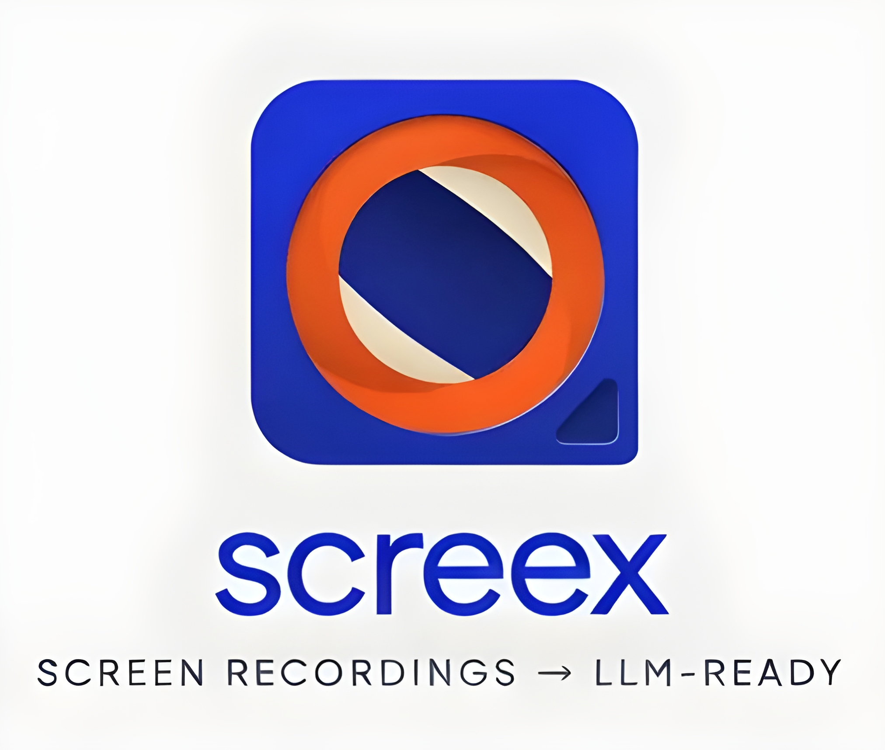
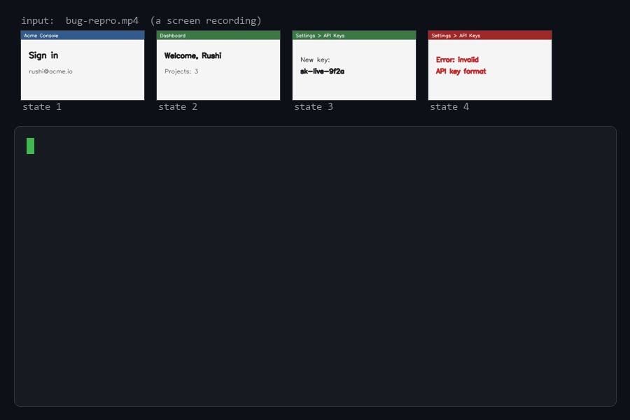

<p align="center">
  
</p>

<p align="center"><em>Your LLM can't watch a screen recording. Screex turns one into text it can read.</em></p>

<p align="center">
  <a href="https://pypi.org/project/screex/"></a>
  
  <a href="https://github.com/blueprintparadise/Screex/actions/workflows/ci.yml"></a>
  
</p>

# Screex

**Screen-recording understanding for agents.** Screex turns a screencast into a queryable
**index** of UI states — each with the on-screen text (OCR), what text changed since the
previous state, a thumbnail, and a full-resolution keyframe — so an LLM/agent can produce an
action transcript, answer questions, or generate a how-to guide / bug report from a recording.

- **Training-free & model-agnostic** — no fine-tuned UI model; any LLM can read the index.
- **`pip install`-only** — OCR via [`rapidocr-onnxruntime`](https://pypi.org/project/rapidocr-onnxruntime/), no system binaries.
- **Server-friendly runtime** — uses headless OpenCV, so CI and Linux servers do not need GUI
  libraries just to build indexes.
- **Cheap by design** — the on-screen text is plain text (nearly free to read); full-res
  keyframes are escalated to only when the text is insufficient.
- **Fast OCR** — tuned onnxruntime threading makes text extraction ~3.85× faster than the default.
- **Narration-aware** — with `pip install 'screex[audio]'`, the index includes a timestamped transcript of the spoken audio, interleaved into the step transcript.

**Good for:** bug repros → reproduction reports · demos & Loom videos → how-to docs ·
tutorials → step lists · *"what did the user do / what URL did they open?"* Q&A over a recording.

---

## Example

<p align="center">
  
</p>

A short screen recording of a login → settings → error flow becomes a timestamped step list:

```bash
screex transcript bug-repro.mp4 -o steps.md
```

`steps.md`:

```
# Transcript — bug-repro.mp4  (0:06)

## 0:00–0:01  ·  State 1
Acme Console · Sign in · Email: rushi@acme.io
**Appeared:** Acme Console, Sign in

## 0:01–0:02  ·  State 2
Dashboard · Welcome back, Rushi · Projects: 3
**Appeared:** Dashboard, Welcome back, Rushi
**Gone:** Acme Console, Sign in

## 0:03–0:04  ·  State 3
Settings > API Keys · New key: sk-live-9f2a · [ Save ]
**Appeared:** Settings > API Keys, New key: sk-live-9f2a

## 0:04–0:06  ·  State 4
Error: invalid API key format · Expected prefix 'sk_' not 'sk-'
**Appeared:** Error: invalid API key format
```

Prefer richer output? Hand the `index.json` to Claude via the bundled skill and ask for a
**bug report**, a **how-to guide**, or **answers to questions** about the recording.

---

## Install

### From PyPI
```bash
pip install screex
```

For spoken-word narration in the index, also install the audio extra: `pip install 'screex[audio]'`.

### From source
```bash
git clone https://github.com/blueprintparadise/Screex.git
cd Screex
pip install -e .          # add ".[test]" to also install pytest
```

Both give you a `screex` command (entry point `screex.cli:main`). Requires Python ≥ 3.9.
First run downloads the small RapidOCR ONNX models automatically.

---

## Quickstart (CLI)

```bash
# Build the index for a screen recording
screex index path/to/recording.mp4 --fps 2
#   (or, without installing the package:)
python -m screex.cli index path/to/recording.mp4 --fps 2
```

This writes:
```
path/to/recording.screex/
  index.json            # the ScreenIndex (ordered UI states)
  frames/00000.png      # full-res keyframe per state
  frames/00000_thumb.png# thumbnail per state
  ...
```

### `index` options
| Flag | Default | Meaning |
|------|---------|---------|
| `--fps` | `2` | frames sampled per second (raise for fast-moving recordings) |
| `--change-threshold` | `0.04` | mean frame-to-frame intensity change (0–1) that starts a new UI state; also fires on cumulative drift from the state's anchor frame (catches slow scrolls/fades). Lower = more states, higher = fewer |
| `--text-threshold` | `0.80` | **(default text mode)** start a new state when on-screen text similarity vs the current state drops below this (0–1) |
| `--motion-epsilon` | `0.003` | skip OCR on frames essentially identical to the previous one (performance only) |
| `--fast` | off | motion-only segmentation (no per-frame OCR) — faster, but misses subtle local changes |
| `--ocr-threads` | `2` | onnxruntime intra-op threads for OCR — 2 is ~3.85× faster than the library default on typical CPUs; `0` = library default |
| `--no-audio` | off | skip speech-to-text narration (on by default when `screex[audio]` is installed) |
| `--whisper-model` | `base` | faster-whisper model for narration (`tiny`/`base`/`small`/`medium`) |
| `--dedupe-threshold` | `0.95` | merge consecutive states whose on-screen text is at least this similar (0–1); set `>1` to disable |
| `--thumb-width` | `320` | thumbnail width in px |
| `--keyframe-format` | `png` | `png` (lossless) or `jpg` (much smaller) for keyframes/thumbnails |
| `--keyframe-quality` | `90` | JPEG quality (only used with `jpg`) |
| `--max-frames` | _none_ | cap sampled frames (guardrail for long/high-res recordings) |
| `--lang` | _auto_ | OCR language hint |
| `--out` | `<recording>.screex` | output directory |
| `-q, --quiet` | off | suppress progress output (place before the subcommand) |

### Transcript (no LLM needed)

Turn a recording straight into a timestamped markdown step list:

```bash
screex transcript path/to/recording.mp4 -o steps.md    # omit -o to print to stdout
screex transcript path/to/recording.mp4 --from-index path/to/recording.screex/index.json
```

By default `index`/`transcript` segment by **on-screen text change**, so a dialog or a status
line appearing becomes its own step. Use `--fast` for motion-only segmentation on simple clips.

### What `index.json` contains
A `schema_version`, the source `video`/`duration`/`sampled_fps`, and an ordered list of
`states`, each with:
`t_start` / `t_end`, `ocr_text` (on-screen text lines), `text_added` / `text_removed`
(text that appeared/disappeared vs the previous state — the strongest signal of what the user
did), `thumbnail` / `keyframe` paths, and optional `warnings` for recoverable diagnostics such
as OCR failures on individual frames.

---

## Use as a Claude skill

Screex ships a `SKILL.md` that teaches Claude to build the index and turn it into one of three
views: an **action transcript**, **Q&A** over the recording, or a **how-to / bug report**.

1. **Install the package** so `python -m screex.cli` is available in the environment Claude
   uses (`pip install -e .`).
2. **Install the skill** — the package bundles `SKILL.md`, so one command installs it where
   Claude Code discovers skills:
   ```bash
   screex skill --install                                          # ~/.claude/skills/screex/
   screex skill --install --dir <project>/.claude/skills/screex    # per-project
   screex skill --path                                             # just print the target path
   screex skill --check                                            # is the installed skill current?
   ```
3. **Use it** — in Claude Code, just ask in natural language, e.g.:
   - *"Use screex to turn `~/Downloads/bug-repro.mp4` into a bug report."*
   - *"What steps does this screen recording show?"*
   - *"From this demo, write a how-to doc."*

   Claude runs `screex index`, reads `index.json`, skims the on-screen text across states, and
   escalates to a full-res keyframe only when the text isn't enough — then produces the
   transcript / answer / document.

> The skill is model-agnostic: the same `index.json` can be read by any LLM/agent, not only
> Claude.

**Staying current:** upgrading the package does not re-copy `SKILL.md`. After an upgrade run
`pip install -U screex && screex skill --install`; `screex skill --check` tells you if your
installed skill is behind the package.

---

## How it works

```
recording → sample frames → segment into UI states → per state: OCR text + text-diff
          → write thumbnail + full-res keyframe → index.json
                                                      ↓
            views (agent-driven): transcript · Q&A · how-to / bug report
```

`screex/core/`:
- `source` — decode & sample frames (OpenCV)
- `segment` — group frames into settled UI states by visual change
- `ocr` — RapidOCR text extraction + text-diff between states
- `index` — the `ScreenState` / `ScreenIndex` schema (JSON)

`screex/cli.py` wires them into the `screex index` command.

---

## Development

```bash
pip install -e ".[test]"
python -m pytest -q
```

---

## License

[MIT](LICENSE) © 2026 Rushikesh Hiray
